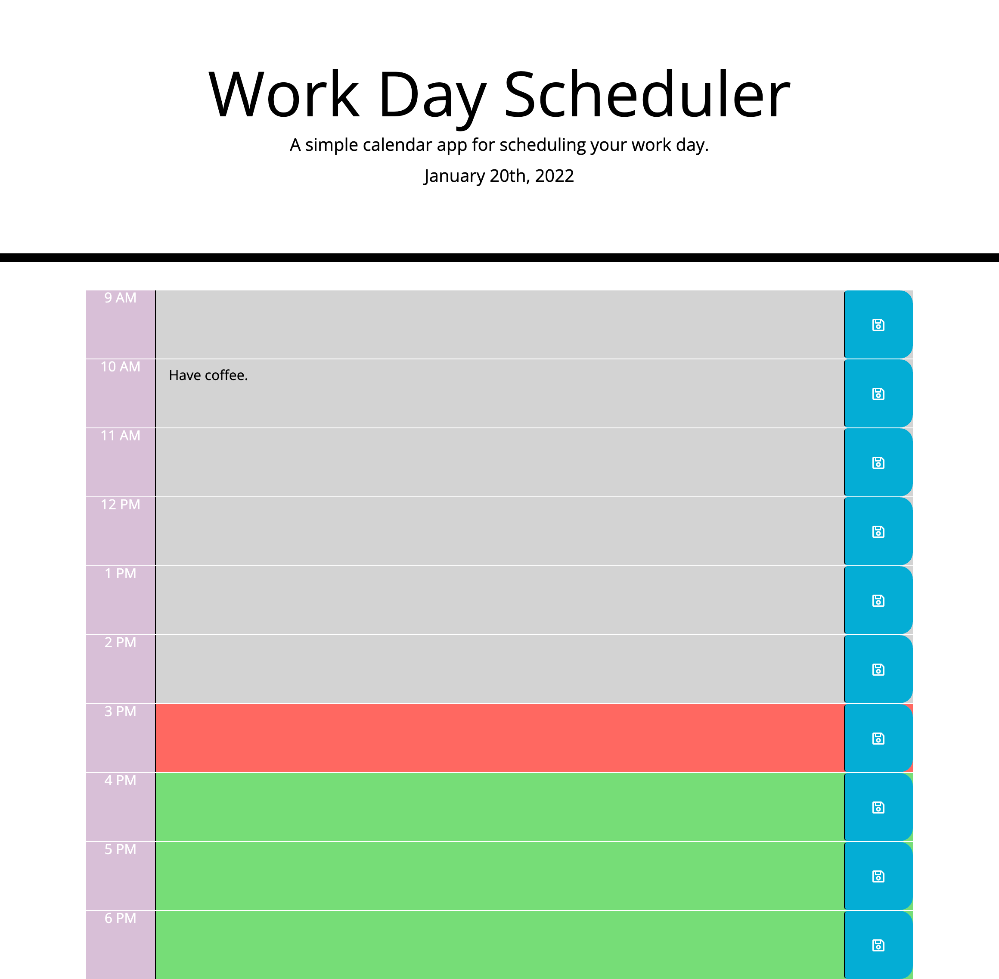

# Homework 5 Workday Scheduler

## Description

This code quiz was built using HTML, CSS, Javascript, JQuery, and Moment.

## Screenshot

## Links to Application

- Here is a link to the repository: https://github.com/heatherveva/hw4.git
- Here is the page: https://heatherveva.github.io/hw4/
